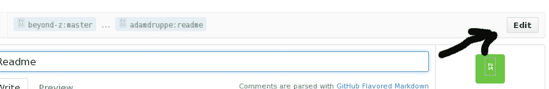
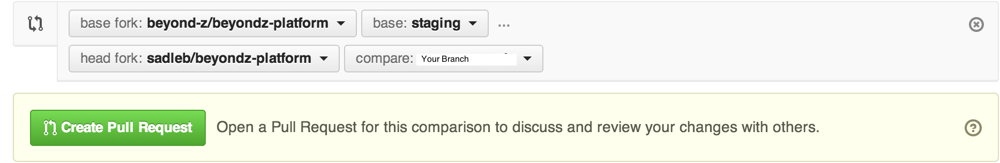

This is where Beyond Z participants login and access their leadership development portal.


# Getting Started


Follow this tutorial to get Rails setup for Heroku:
https://devcenter.heroku.com/articles/getting-started-with-rails4

You must install Postgres (http://postgresapp.com/)
and set your PATH in your ~/.bashrc:

	export PATH="/Applications/Postgres93.app/Contents/MacOS/bin:$PATH"

After your environment is setup, fork this repository on Github. Then in the location you want the local copy, run:

	git clone <your_forked_url>

To get all your gems, run:

	bundle install

## Configuration

In the "/env.sample" file is a list of environment variables that must be set for your database, SMTP, etc... to function properly. Copy this file to ".env"  and be sure these values are set for your Rails environment using your Foreman, Pow or preferred server setup.

### Creating a new Secret Token

	rake secret
	
Take the results of the above command and put this in your ".env" file for RAILS\_SECRET\_TOKEN.

## Running the Application 
From your repo directory:

	rake db:create
	rake db:migrate

And to start website on local machine, run: $foreman start and the app will be available at http://localhost:3000

## Code Management

Here is a nice description of the workflow we follow, which is also
detailed below:
http://nathanhoad.net/git-workflow-forks-remotes-and-pull-requests 

### Setup
To move on with development, run:

	git remote add upstream https://github.com/beyond-z/beyondz-platform.git
	
	
This makes the upstream (original repo) code available for merging into your local fork.

### Flow

Always create a new branch when working on a new feature. From your local master branch:

	git checkout -b <feature_name>

To commit all changes:

	git commit -am 'a brief message saying what you did. think about future readers.'

To push your local changes to your Github fork, run the static code analysis lint tool 
and the tests like this:

	rubocop .
	rake test
	git push origin <feature_name>

To submit a pull request and integrate your changes back to the main
repository do the following:

Select the feature branch from your Github page using the drop down selector. 


Then click the green pull request button to the left hand side of the drop down.

On the next screen, click "Edit" near the right-hand side of the screen.



Then choose the 'staging' branch of the beyondz-platform. 



Write a meaningful title and summary so it is well documented what this "feature" 
is when looking back or at a glance.  Your pull request will be rejected if the 
title and  summary is cryptic for other readers.

Once the pull is merged, do some cleanup on your local branch:

* Stay up to date by merging the staging repository back to your
local branch.
```
	git pull upstream staging
```

* Switch back to staging (or some other branch) and delete the feature
branch (locally and remotely)
```
  git checkout staging
  git branch -d <feature_name>
  git push origin :<feature_name>
```

### Continuous Integration
We use a continuous integration test server on all pull requests. When you
open a pull request, it will be automatically tested and the results displayed
on GitHub in the form of a checkbox or an X mark.

The current integration runs the test suite as well as rubocop. Any errors resulting from either will show as a failure.

You can see the details here: https://travis-ci.org/beyond-z/beyondz-platform

# Coding Conventions

## Ruby/Rails

We use standard Rails code conventions with some additional rules:

  * Indent each level with two spaces
  * Always raise subclasses of Exception specialized to your need, and always rescue a specific type.
  * Always use Rails database migrations when adding new data.
  * Write the main class at the top of the file. Try to stick to one class per file, but a small helper (e.g. an exception subtype) may appear below the main class.
  * Always use begin, raise, and rescue for error handling. Don't use throw and catch in Ruby.
  * Keep individual lines simple. If a new reader can't immediately tell what it is doing, either simplify the code or refactor it into a named method.
  * Use the flash hash to quick message workflows.
  * Never commit a FIXME: either fix it or make a task in Asana.

This is the full style guide we adhere to: https://github.com/bbatsov/ruby-style-guide

Remember to run rubocop before submitting pull requests to help keep code up to standards.

## CSS

Structure CSS files according to the .

  * Avoid placing CSS in view files.
  * Indent each level with two spaces
  * Use dashes in class/id names, not underscores.
  
	**Fig. 1**
  
	```
	.content-container ...

	// NOT
	.content_container ...
	```
  * Beginning curly brace should be on the same line as the class name (see fig 2).
  * Ending curly brace should be vertically inline with the class name (see fig 2).
  * Use empty lines between class definitions (see fig 2).
  
  	**Fig. 2**
  	```
	body {
	  background-color: #fff;
	}
					// <-- empty line
  	.content-container {
  	  color: #eee;
  	  width: 100%;
  					// <-- empty line
	  .section {
		font-size: 1.5em;
	  }
	}

  	// NOT
  	.content-container { ... }
  	
	// OR
	.content-section
	{
	  ...
	}
  	```
  * Use Bootstrap styles and components (CSS and JS) whenever possible (see fig 3).
  * Whenever possible, avoid using Bootstrap classes directly in view files. Instead, create a class that extends Bootstrap classes (see fig 3).
  	
	**Fig. 3**
  	```
  	// in the CSS
  	.attachment-button {
      @extend .btn;
      @extend .btn-default;
      @extend .glyphicon;
      @extend .glyphicon-paperclip;
      margin-right: 2em;
      float: left;
    }
    
	// in the HTML
	<button id="attachment-button"></button>
    
	// NOT
	// in the CSS
  	.attachment-button {
      float: left;
    }
    
	// in the HTML
	<button id="attachment-button btn btn-default glyphicon glyphicon-paperclip"></button>
  	```
  * Utilize SASS, but minimize nesting. Be aware of bloat and cascading brittleness (see fig 4).
  * All styles should be properly scoped so that generic classes like ".document" or ".form" don't accidentally override other styles. Instead use something like ".comment .document" or ".comment form" to limit their application.
  	
	**Fig. 4**
  	```
  	// This scopes the generic elements sufficiently under a unique
  	// "special-form" class. If the designer wanted to move the "button-1"
  	// HTML element inside either column, the style would still apply.
  	// This also scopes the generic classes like 'column-1' under a
  	// unique class 'special-form'.
  	
  	.special-form {
  	  .column-1 {
  	  	...
  	  }
  	  
	  .column-2 {
	    ...
	  }
	  
	  .button-1 {
	  	...
	  }
	  
	  .button-2 {
	  	...
	  }
	}
	
	// NOT
	// This creates unnecessary class definition length and restricts minor
	// design changes because the CSS nesting mimics the HTML nesting.  If the
	// designer wanted to move the "button-1" HTML element inside of the
	// "column-1" HTML element, the style would NOT be applied.
	
	.special-form {
  	  .column-1 {
  	  	...
  	  }
  	  
	  .column-2 {
	  	...
	  	
	  	.button-1 {
	 	  ...
	 	}
	  
	  	.button-2 {
	  	  ...
	  	}
	  }
	}
  	```
  * Consider refactoring and generalizing styles into the asset management structure to maximize reuse.
  * Try to use scalable sizing for all elements. Opt for "em" over "px" (see fig 5).
  * Choose semantic concepts for styles over those that are page specific, mapped to HTML structures, or style descriptions.
  	
  	**Fig. 5**
  	```
  	// Do's
  	.page-header {
      font-size: 2em;
      width: 100%;
  	}
  	
	.basic-list {
	  margin-top: 3em;
	  
		li {
		  color: #eee;
		}
	}
	
	// name is not overly style descriptive
	.thick-bottom-line {
	  border-bottom: solid 10px #f00;
	}
	
	// reusable class extends generic class (but could extend .thin-bottom-line)
	.page-title {
	  @extend .thick-bottom-line;
	  
	}

  	// Dont's
  	.contact-page-header {
  	  font-size: 16px;
  	  width: 100%;
  	}
  	
	.article-list {
	  margin-top: 10px;
	  
		.article-list-item {
		  color: #eee;
		}
	}
	
	.line_10px_red {
	  border-bottom: solid 10px #f00;
	}
  ```
  * When possible use CSS selectors that address tags instead of custom names. This will reduce extraneous class definitions and HTML bloat. It also makes the CSS clear as to what type of element is being referenced without having to traverse the HTML.
  
  **Fig. 6**
  ```
  	// If you know that "special-form" is a form and had a submit button
  	// there is rarely a need to give it an id or class and define a named
  	// CSS style for it.
  	
  	.special-form {
  	  .input[type=submit] {
  	  	...
  	  }
  	}
	
	// NOT	
	.special-form {
  	  .submit-button {
  	  	...
  	  }
	}
  	```
  

## JavaScript

Structure JS files according to the .

  * Avoid placing JS in view files.
  * Indent each level with two spaces
  * Use Bootstrap components wherever possible.
  * Use JQuery for additional components or to add interactivity, etc...
  * Use inline curly braces.
  	```
  	say_hello = function()
  	{
  	  ...
  	}
  	
	if(true)
	{
	  ...
	}
	else
	{
	  ...
	}
	
	// NOT	
	say_hello = function(){
  	  ...
  	}
  	
	if(true){
	  ...
	}
	else{
	  ...
	}
	```
  * Properly scope selectors so to avoid side effects on other elements (see below).
  * Reuse selector variables wherever possible. No need to continually reselect the same HTML elements.
  	```
  	var list_items = $('.basic-list li');
  	
	list_items.hide();
	list_items.show();
  	
	
	// NOT	
	$('li').hide();
	$('li').show();
	```