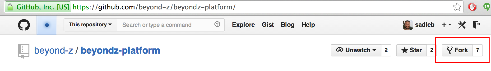
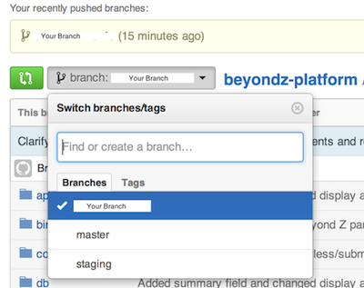
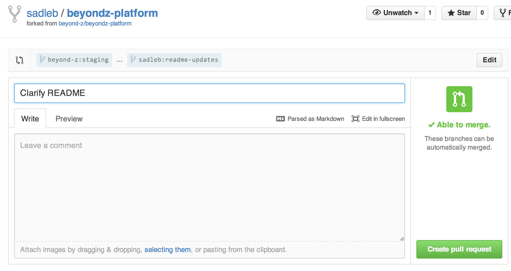

This is where Beyond Z participants login and access their leadership development portal.


# Getting Started

Make sure you have Ruby 2.1.1 and Rails 4.0 installed and configured.  You can
check by running:
 ```Shell
ruby -v 
```
and
```Shell
rails -v
```
If you don't,
[this guide](http://guides.rubyonrails.org/getting_started.html#installing-rails)
is a good start to get you going (or please link to a better tutorial in this readme once you find one)

Note: in production this site runs on Heroku.  It was setup using [this
tutorial](https://devcenter.heroku.com/articles/getting-started-with-rails4)

Check to see that you have Postgres 9.3.2 installed
```Shell
psql -V
```

If not, [install it](http://postgresapp.com/) and make sure to and set your PATH in your ~/.bashrc, for example:
```Shell
	export PATH="/Applications/Postgres93.app/Contents/MacOS/bin:$PATH"
```

Create a database user for the BZ application:
```Shell
createuser -s beyondz-platform
```

After your prerequisites are installed and setup, fork the `beyondz-platform` repository into your own Github account.



Then in the location you want the local code to live on your development
machine, run:
```Shell
git clone <your_forked_url>
```
Get all your gems installed by running:
```Shell
bundle install
```
## Configuration

There are a handful of environment variables that store sensitive information that this application uses to run.  The list can be found in the `/env.sample` file. 

One easy way to manage your ENV variables is using Foreman (or Pow).  If
you install Foreman using:
```Shell
gem install foreman
```
Then you can setup your ENV variables by copying env.sample to .env and editing
the values that you need.
```Shell
cp env.sample .env
```
When you run
```Shell
foreman start
```
it reads the `.env` file and sets those environment variables for your
session.

The minimum list of variables needed to make the basic application work are:
`RAILS_SECRET_TOKEN`
`DATABASE_USERNAME`
`DATABASE_PASSWORD` 
`DEVISE_SECRET_KEY` 
`DEVISE_PEPPER`

For the secret and pepper variables above, you can generate them using
```Shell
rake secret
```

## Integrating with Canvas
Five environment variables relate to using the Canvas LMS through its REST API:

CANVAS_ACCESS_TOKEN=<token created in canvas admin for app integration>
CANVAS_SERVER=<domain of canvas server>
CANVAS_PORT=<port of canvas server>
CANVAS_USE_SSL=<true or false>
CANVAS_ALLOW_SELF_SIGNED_SSL=<true or false>

These are self explanatory except for the canvas access token. To create one of these, log into Canvas as the admin user and click settings (upper right corner of the screen). Scroll down to "Approved Integrations" and generate a new access token. That is the value needed for CANVAS_ACCESS_TOKEN.

## Running the Application 
From the directory you cloned your repo to run:
```Shell
rake db:create
rake db:migrate
rake db:seed
```
Finally, start the application by running
```Shell
foreman start
```
The app will be available at [http://localhost:5000](http://localhost:5000) by default

## Testing
We have created a few test users that you can login to the platform with.  They are populated using the `rake db:seed` task.

    username: test+student1@beyondz.org
    password: test

    username: test+coach1@beyondz.org
    password: test

    username: test+admin@beyondz.org
    password: test

## Development Process

Here is a [nice overview](http://nathanhoad.net/git-workflow-forks-remotes-and-pull-requests) of the workflow we follow, which is also detailed below.

### Setup
Make the upstream (the original) repo available for merging into your local fork so that you always can get the most up-to-date code:
```Shell
git remote add upstream https://github.com/beyond-z/beyondz-platform.git
```

### Flow

We work on new development in the `staging` branch.  For each new
feature or change you want to make, always begin by making a new branch:
```Shell
git checkout staging
git checkout -b <feature_name>
```
Once you've made all your changes, commit using:
```Shell
git commit -am 'a brief message saying what you did. think about future readers.'
```
You can commit multiple times to your branch before you are ready to have your changes merged into the upstream repo.

To get ready to submit a pull request to the upstream repo, you need to push your local changes to your Github fork.  Please run the static code analysis and tests before doing so, like this:
```Shell
rubocop .
rake test
git push origin <feature_name>
```
To submit a pull request and integrate your changes back to the upstream 
repository do the following:

Select the feature branch from your Github page using the drop down selector. 




Then click the green pull request button to the left hand side of the drop down.

On the next screen, write a meaningful title and summary so it is well documented what this "feature" 
is when looking back or at a glance.  Your pull request will be rejected if the 
title and  summary is cryptic for other readers.



Once the pull request is merged by the upstream repo owner, do some cleanup on your local branch:

* Stay up to date by merging the staging repository back to your
local branch.
```Shell
git pull upstream staging
```

* Switch back to staging (or some other branch) and delete the feature
branch (locally and remotely)
```
git checkout staging
git branch -d <feature_name>
git push origin :<feature_name>
```

### Continuous Integration
We use a continuous integration test server on all pull requests. When you
open a pull request, it will be automatically tested and the results displayed
on GitHub in the form of a checkbox or an X mark.

The current integration runs the test suite as well as rubocop. Any errors resulting from either will show as a failure.

You can see the details [here](https://travis-ci.org/beyond-z/beyondz-platform)

# Coding Conventions

## Ruby/Rails

We use standard Rails code conventions with some additional rules:

  * Indent each level with two spaces
  * Always raise subclasses of Exception specialized to your need, and always rescue a specific type.
  * Always use Rails database migrations when adding new data.
  * Write the main class at the top of the file. Try to stick to one class per file, but a small helper (e.g. an exception subtype) may appear below the main class.
  * Always use begin, raise, and rescue for error handling. Don't use throw and catch in Ruby.
  * Keep individual lines simple. If a new reader can't immediately tell what it is doing, either simplify the code or refactor it into a named method.
  * Use the flash hash to quick message workflows.
  * Never commit a FIXME: either fix it or make a task in Asana.

This is the full style guide we adhere to: https://github.com/bbatsov/ruby-style-guide

Remember to run rubocop before submitting pull requests to help keep code up to standards.

## CSS

Structure CSS files according to the .

  * Avoid placing CSS in view files.
  * Indent each level with two spaces
  * Use dashes in class/id names, not underscores.
  
	**Fig. 1**
  
	```
	.content-container ...

	// NOT
	.content_container ...
	```
  * Beginning curly brace should be on the same line as the class name (see fig 2).
  * Ending curly brace should be vertically inline with the class name (see fig 2).
  * Use empty lines between class definitions (see fig 2).
  
  	**Fig. 2**
  	```
	body {
	  background-color: #fff;
	}
					// <-- empty line
  	.content-container {
  	  color: #eee;
  	  width: 100%;
  					// <-- empty line
	  .section {
		font-size: 1.5em;
	  }
	}

  	// NOT
  	.content-container { ... }
  	
	// OR
	.content-section
	{
	  ...
	}
  	```
  * Use Bootstrap styles and components (CSS and JS) whenever possible (see fig 3).
  * Whenever possible, avoid using Bootstrap classes directly in view files. Instead, create a class that extends Bootstrap classes (see fig 3). This doesn't mean that you create a custom class for everything. You can use Bootstrap classes in the HTML, but opt for using existing defined styles or abstracting to more generic reusable styles that extend Bootstrap.
  	
	**Fig. 3**
  	```
  	// in the CSS
  	.attachment-button {
      @extend .btn;
      @extend .btn-default;
      @extend .glyphicon;
      @extend .glyphicon-paperclip;
      margin-right: 2em;
      float: left;
    }
    
	// in the HTML
	<button id="attachment-button"></button>
    
	// NOT
	// in the CSS
  	.attachment-button {
      float: left;
    }
    
	// in the HTML
	<button id="attachment-button btn btn-default glyphicon glyphicon-paperclip"></button>
  	```
  * Utilize SASS, but minimize nesting. Be aware of bloat and cascading brittleness (see fig 4).
  * All styles should be properly scoped so that generic classes like ".document" or ".form" don't accidentally override other styles. Instead use something like ".comment .document" or ".comment form" to limit their application.
  	
	**Fig. 4**
  	```
  	// This scopes the generic elements sufficiently under a unique
  	// "special-form" class. If the designer wanted to move the "button-1"
  	// HTML element inside either column, the style would still apply.
  	// This also scopes the generic classes like 'column-1' under a
  	// unique class 'special-form'.
  	
  	.special-form {
  	  .column-1 {
  	  	...
  	  }
  	  
	  .column-2 {
	    ...
	  }
	  
	  .button-1 {
	  	...
	  }
	  
	  .button-2 {
	  	...
	  }
	}
	
	// NOT
	// This creates unnecessary class definition length and restricts minor
	// design changes because the CSS nesting mimics the HTML nesting.  If the
	// designer wanted to move the "button-1" HTML element inside of the
	// "column-1" HTML element, the style would NOT be applied.
	
	.special-form {
  	  .column-1 {
  	  	...
  	  }
  	  
	  .column-2 {
	  	...
	  	
	  	.button-1 {
	 	  ...
	 	}
	  
	  	.button-2 {
	  	  ...
	  	}
	  }
	}
  	```
  * Consider refactoring and generalizing styles into the asset management structure to maximize reuse.
  * Try to use scalable sizing for all elements. Opt for "em" over "px" (see fig 5).
  * Choose semantic concepts for styles over those that are page specific, mapped to HTML structures, or style descriptions.
  	
  	**Fig. 5**
  	```
  	// Do's
  	.page-header {
      font-size: 2em;
      width: 100%;
  	}
  	
	.basic-list {
	  margin-top: 3em;
	  
		li {
		  color: #eee;
		}
	}
	
	// name is not overly style descriptive
	.thick-bottom-line {
	  border-bottom: solid 10px #f00;
	}
	
	// reusable class extends generic class (but could extend .thin-bottom-line)
	.page-title {
	  @extend .thick-bottom-line;
	  
	}

  	// Dont's
  	.contact-page-header {
  	  font-size: 16px;
  	  width: 100%;
  	}
  	
	.article-list {
	  margin-top: 10px;
	  
		.article-list-item {
		  color: #eee;
		}
	}
	
	.line_10px_red {
	  border-bottom: solid 10px #f00;
	}
  ```
  * When possible use CSS selectors that address tags instead of custom names. This will reduce extraneous class definitions and HTML bloat. It also makes the CSS clear as to what type of element is being referenced without having to traverse the HTML.
  
  **Fig. 6**
  ```
  	// If you know that "special-form" is a form and had a submit button
  	// there is rarely a need to give it an id or class and define a named
  	// CSS style for it.
  	
  	.special-form {
  	  .input[type=submit] {
  	  	...
  	  }
  	}
	
	// NOT	
	.special-form {
  	  .submit-button {
  	  	...
  	  }
	}
  	```
  

## JavaScript

Structure JS files according to the .

  * Avoid placing JS in view files.
  * Indent each level with two spaces
  * Use Bootstrap components wherever possible.
  * Use JQuery for additional components or to add interactivity, etc...
  * Use inline curly braces.
  	```
  	say_hello = function()
  	{
  	  ...
  	}
  	
	if(true)
	{
	  ...
	}
	else
	{
	  ...
	}
	
	// NOT	
	say_hello = function(){
  	  ...
  	}
  	
	if(true){
	  ...
	}
	else{
	  ...
	}
	```
  * Properly scope selectors so to avoid side effects on other elements (see below).
  * Reuse selector variables wherever possible. No need to continually reselect the same HTML elements.
  	```
  	var list_items = $('.basic-list li');
  	
	list_items.hide();
	list_items.show();
  	
	
	// NOT	
	$('li').hide();
	$('li').show();
	```
